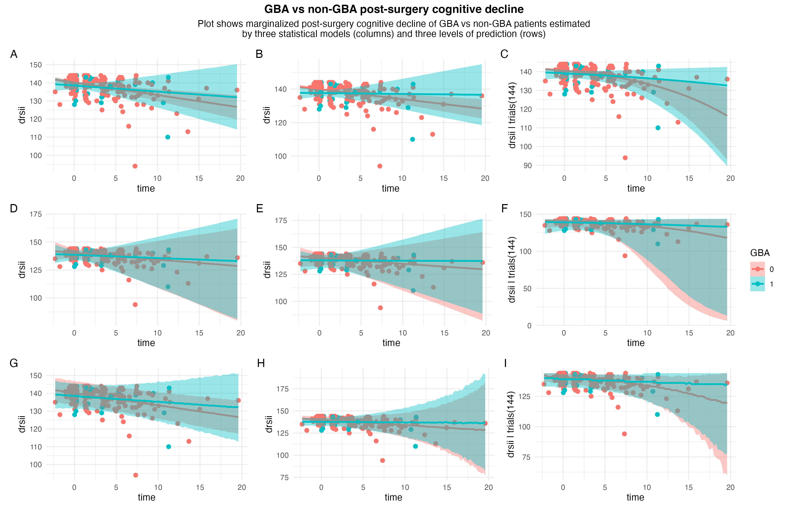

# Cognitive trajectories of PD with GBA mutation treated via STN DBS

Data were kept in iTEMPO (First Faculty of Medicine, Charles University, Prague) internal database and extracted via [scripts from my data management repository](https://www.github.com/josefmana/dbs_dataMANA).

The [renv](https://rstudio.github.io/renv/) package was used to create reproducible environment for the project. To set-up R environment for reproduction of my results, run the following in R:
```
install.packages("renv")
renv::restore()
```

## Introduction

This project commenced as a reaction to recent reports of GBA+ genotype being associated with long-term cognitive decline operationalised by DRS-2 score especially in STN DBS treated PD patients by [Pal et al. (2022)](https://doi.org/10.1002/ana.26302) and [Avenali et al. (2024)]((https://doi.org/10.1136/jnnp-2023-332387). Both groups reported a markedly larger post-surgery DRS-2 decline in GBA+ compared to GBA- in large multicentric data sets of patients with PD. Here, I describe post-surgery cognitive trajectories in DRS-2 of GBA+ and GBA- patients with PD who are part of a longitudinally collected data from [iTEMPO](https://neurologie.lf1.cuni.cz/1LFNK-289.html) at the First Faculty of Medicine of Charles University in Prague.


## Methods

Statistically,the basic model I fit is a multilevel regression with Gaussian error term, mean predicted by group-level time and GBA status interaction ('fixed effects') and patient-level intercepts and time slopes offsets ('random effects'), and residual standard deviation identical across cases. This is similar to the approach used by [Pal et al. (2022)](https://doi.org/10.1002/ana.26302) who further added group-level parameters for other variables (without any theoretical argument for their inclusion mind you), did not include any patient-level parameters but instead modelled site-level intercepts (assuming identical side- and patient-level slopes). I compare the results of this model to an otherwise identical model with time-dependent group-level parameters for standard deviation (accounting for time-dependent heteroscedasticity), and a Beta-Binomial model with an equivalent specification. All models were fitted via the [brms](https://github.com/paul-buerkner/brms.git) package in the Bayesian framework with default brms priors.


## Results

Patient/measuring occasion distribution is available in ```figs/assessment_distributions.jpg```. All models converged successfully and reproduced central tendency and spread indexes of the data reasonably well (@fig-ppc). The second Normal model lead to a significant improvement over the first Normal model as can be seen in the posterior predictive check (PPC) for median and IQR and was further corroborated by ELPD expected out-of-sample predictive performance estimated via PSIS-LOO which showed advantage of the second model that was more than 2 SDs away from zero. Further PPCs are presented in ```figs/ppc_shape.jpg```.

{#fig-ppc}

The estimated cognitive trajectories are presented in @fig-meff for each model (columns) on level of sample-level inference (the first row), population-level inference (the second row), and prediction (the third row). Overall, not much differences between GBA+ and GBA- can be inferred from my data and models.

{#fig-meff}


## Conclusions

Time-dependent non-homogeneity of variance in DRS-2 scores of STN DBS-treated patients with PD is a thing and should not be ignored. Replicating the worse DRS-2 post-surgery decline in GBA+ PD patients compared to GBA- PD patients treated via STN DBS is not easily observed in an independent sample of patients, at least not in the Prague cohort.
